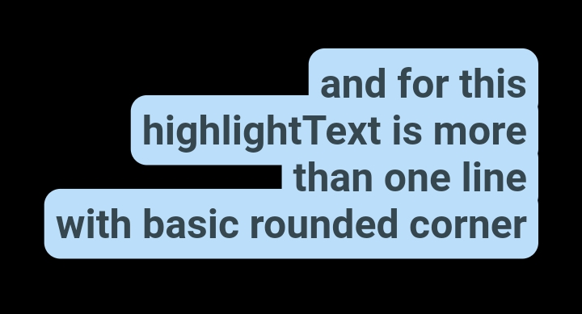

# Text Highlight Rounded

## Description

A custom widget which provides rounded highlighted text, made with painter

## Example

<a href="https://github.com/arif-pandu/text_highlight_rounded/tree/main/example/1.png">
   
</a>


```dart
HighlightTextRounded(
    text: "one line only",
    style: TextStyle(
    fontSize: 20,
    color: Colors.black,
),
```

<a href="https://github.com/arif-pandu/text_highlight_rounded/tree/main/example/2.png">
   
</a>

```dart
HighlightTextRounded(
    text: "and for this\nhighlightText is more\nthan one line\nwithall rounded corners",
    textAlign: TextAlign.center,
    bold: 7,
    isAllCornerRound: true,
    radius: 10,
    markColor: Colors.red[100]!,
    style: const TextStyle(
        fontSize: 25,
        fontWeight: FontWeight.bold,
        color: Colors.purple,
    ),
),
```


<a href="https://github.com/arif-pandu/text_highlight_rounded/tree/main/example/3.png">
   
</a>

```dart
HighlightTextRounded(
    text: "and for this\nhighlightText is more\nthan one line\nwith basic rounded corner",
    textAlign: TextAlign.right,
    bold: 7,
    radius: 10,
    isAllCornerRound: false,
    markColor: Colors.blue[100]!,
    style: TextStyle(
        fontSize: 25,
        fontWeight: FontWeight.bold,
        color: Colors.blueGrey[800],
    ),
),
```

## Parameter
- `String` text
- `TextStyle` style;
- `double`? maxWidth;
- `double` radius;
- `Color` markColor;
- `TextAlign` textAlign;
- `double` bold;
- `bool` isAllCornerRound;


